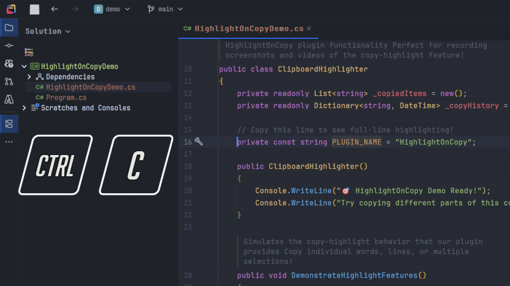
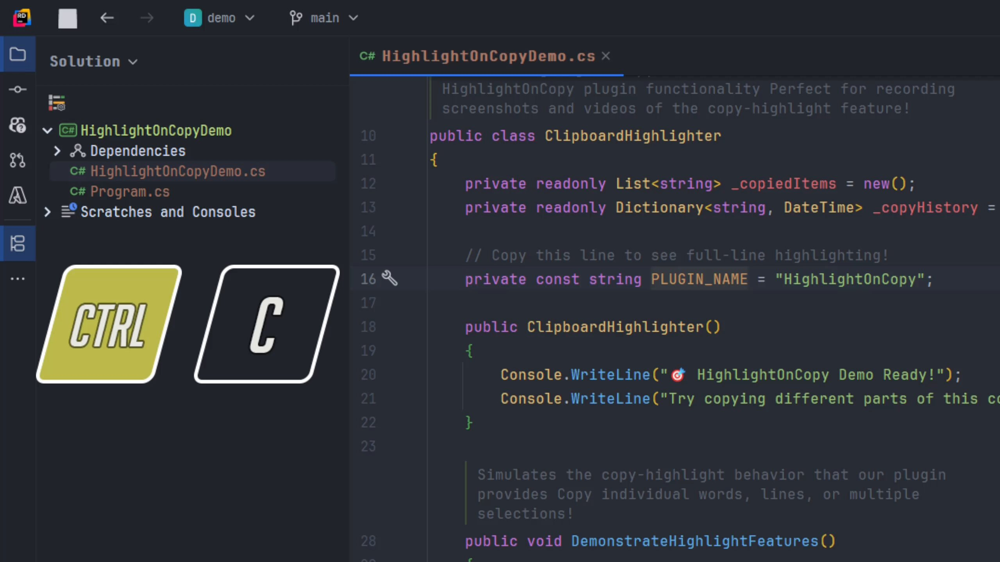
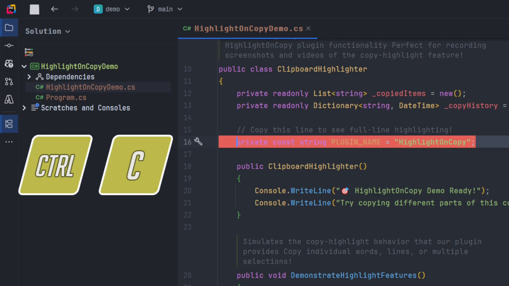
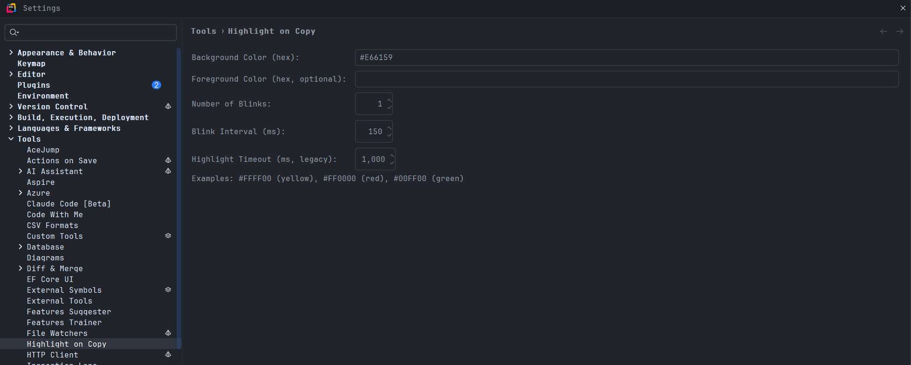

# Highlight on Copy


[](https://plugins.jetbrains.com/plugin/27575-highlight-on-copy)
[](https://plugins.jetbrains.com/plugin/27575-highlight-on-copy)
[](https://plugins.jetbrains.com/plugin/27575-highlight-on-copy)

<!-- Plugin description -->
Highlights the text that was just copied to the clipboard with customizable colors and blinking effects.

## Demo



See the plugin in action - when you copy text, it highlights with a customizable blinking effect:

| Before Copy | After Copy (Highlighted) |
|-------------|-------------------------|
|  |  |

**Features:**
- Highlights copied text with configurable background and foreground colors
- Configurable blinking effect with customizable blink count and interval
- Multi-cursor support with intelligent selection handling
- Smart line copying when no text is selected (copies entire line)
- Easy configuration through IDE settings (`Tools > Highlight on Copy`)
- Works with ANY copy action - Ctrl+C, Edit menu, right-click copy, etc.
- Supports both standard (#RRGGBB) and alpha (#RRGGBBAA) hex colors

Perfect for visual feedback when copying code, making it immediately clear what was just copied to the clipboard.

**Usage:**
- Copy text using any method (Ctrl+C, Edit menu, right-click) - copied text will blink
- With no selection, copy action will highlight the entire line
- Multiple cursors supported - all selections will be highlighted
- Configure colors, blink count, and timing in `Settings > Tools > Highlight on Copy`
<!-- Plugin description end -->

## Installation

- **IDE built-in plugin system:**
  <kbd>Settings/Preferences</kbd> > <kbd>Plugins</kbd> > <kbd>Marketplace</kbd> > <kbd>Search for "Highlight on Copy"</kbd> > <kbd>Install</kbd>

- **JetBrains Marketplace:**
  Go to [JetBrains Marketplace](https://plugins.jetbrains.com/plugin/27575-highlight-on-copy) and click <kbd>Install to ...</kbd>

- **Manual:**
  Download the [latest release](https://github.com/Hazzajenko/Jetbrains-Highlight-on-Copy/releases/latest) and install via <kbd>Settings/Preferences</kbd> > <kbd>Plugins</kbd> > <kbd>⚙️</kbd> > <kbd>Install plugin from disk...</kbd>

## Configuration

Go to `Settings > Tools > Highlight on Copy`:



- **Background Color**: Highlight background color (default: #E66159)
- **Foreground Color**: Text color during highlight (leave empty for no change)
- **Number of Blinks**: How many times the text blinks (default: 1)
- **Blink Interval**: Time between blinks in milliseconds (default: 150ms)

## Development

```bash
./gradlew buildPlugin    # Build the plugin
./gradlew test           # Run tests
./gradlew runIde         # Run IDE with plugin
./gradlew verifyPlugin   # Verify plugin compatibility
```

## Contributing

1. Fork the repository
2. Create a feature branch: `git checkout -b feature-name`
3. Make your changes and add tests
4. Run tests: `./gradlew test`
5. Submit a pull request

## Changelog

See [CHANGELOG.md](CHANGELOG.md) for version history.

## License

MIT License - see [LICENSE](LICENSE) for details.

## Support

If you encounter issues or have suggestions, check the [Issues](https://github.com/Hazzajenko/Jetbrains-Highlight-on-Copy/issues) page or create a new issue.
